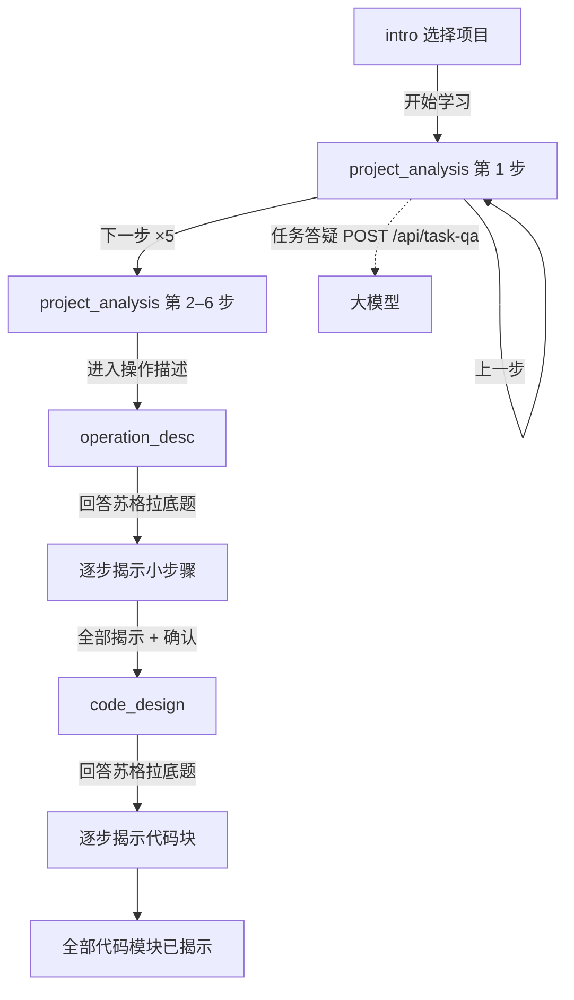

# PLA 项目功能与运行逻辑说明

> **文档名称**：PLA_1_6.24_intro  
> **项目路径**：`d:\Docs\ProjectCode\PLA\cursor`  
> **更新日期**：2026-06-24  
> **适用版本**：内置预设项目「手写数字识别」（MNIST + KNN）四步学习流程

---

## 一、产品定位

**PLA（Programming Learning Assistant）** 是一个面向初学者的**分步编程项目学习助手**。

与早期「用户描述任意项目、AI 动态生成整套方案」的设想不同，**当前版本**采用**内置完整预设项目**的方式：

- 解析内容、操作步骤、代码模块全部预先写好，**不随对话动态改写**
- 用户按固定四步流程学习：从理解项目设计 → 操作落地 → 阅读代码
- 仅在「项目解析」阶段的**任务答疑**接入大模型；操作与代码阶段为**本地预设 + 苏格拉底式引导**

**设计原则**

| 原则 | 说明 |
|------|------|
| 预设完整方案 | 当前唯一项目：MNIST 手写数字识别 + KNN 分类器 |
| 分步揭示 | 每阶段只展示当前进度内容，避免信息过载 |
| 解析阶段不用苏格拉底推进 | 用「上一步 / 下一步」按钮切换 6 个解析步骤 |
| 任务定位 | 「本步任务」描述用户为完成内置项目在该步应做的宏观工作，**不是**向 AI 提交答案 |

---

## 二、整体界面结构

```
┌─────────────────────────────────────────────────────────────┐
│  顶栏：PLA · 项目名称 · 当前阶段标签 · 调试工具栏            │
├─────────────────────────────────────────────────────────────┤
│                                                             │
│  主内容区（随阶段切换）                                       │
│    intro          → 居中项目选择卡片                        │
│    project_analysis → 项目解析面板（本步解析 + 本步任务）      │
│    operation_desc → 操作步骤面板（+ 左侧参考栏）              │
│    code_design    → Monaco 代码编辑器 + 注解（+ 左侧参考栏）   │
│                                                             │
├─────────────────────────────────────────────────────────────┤
│  底部交互区（高度约 300px）                                   │
│    project_analysis → 全宽「任务答疑」对话 + 上一步/下一步/提问  │
│    operation_desc / code_design → 左苏格拉底 + 右自由对话 + 提交 │
└─────────────────────────────────────────────────────────────┘
```

---

## 三、四步工作流

### 阶段概览

| 步骤 | 阶段枚举 | 主内容 | 底部交互 | 内容来源 | 是否接 LLM |
|------|----------|--------|----------|----------|------------|
| 第一步 | `intro` | 项目卡片选择 | 无（选项目后开始） | `presetProjects.ts` | 否 |
| 第二步 | `project_analysis` | 项目解析分步面板 | 任务答疑 + 上/下一步 | `logic_plan` + `analysisTasks` | **是**（`/api/task-qa`） |
| 第三步 | `operation_desc` | 操作步骤（大步骤 + 小步骤） | 苏格拉底 + 自由对话 | `execution_steps` | 否 |
| 第四步 | `code_design` | Monaco 编辑器 + 代码注解 | 苏格拉底 + 自由对话 | `code_blocks` | 否 |

### 流程图



---

## 四、各阶段功能详解

### 4.1 第一步：选择项目（intro）

**组件**：`IntroPanel.tsx`

- 展示预设项目列表（当前仅「手写数字识别」）
- 用户选中项目卡片后点击「开始学习」
- 触发 `handleProjectStart()`，初始化全部状态并进入项目解析第 1 步

**初始化状态**

- `workflowPhase` → `project_analysis`
- `analysisStepIndex` → `1`
- `revealedStepCount` / `revealedCodeCount` → `0`
- `codeBlocks` → 载入预设代码
- `sessionId` → `null`（任务答疑会话重置）
- `messages` → 插入解析阶段引导语

---

### 4.2 第二步：项目解析（project_analysis）

**主面板**：`ProjectAnalysisStepPanel.tsx`

每步只显示**当前一步**（非累积列表），分为两大块：

#### 本步解析

来自 `logic_plan[i]`，含标题与内容说明。共 6 步：

| 步 | 标题 | 要点 |
|----|------|------|
| 1 | 项目目标 | 输入 28×28 灰度图，输出 0–9 类别 |
| 2 | 任务类型 | 图像分类、监督学习 |
| 3 | 数据方案 | MNIST 数据集、784 维特征 |
| 4 | 模型选择 | KNN、欧氏距离 |
| 5 | 评估指标 | 准确率、混淆矩阵 |
| 6 | 模块划分 | 五模块流水线 |

#### 本步任务

来自 `analysisTasks[i]`，与 `logic_plan` 一一对应。UI 结构：

```
本步任务
├── 任务标题（task.title）
├── 专业版（task.summary）          — 规范术语表述
├── 生动版（task.summaryVivid）     — 通俗比喻/场景
├── 对照（task.summaryBridge）      — 比喻与专业术语对应关系
├── 💡 术语说明（termNotes）        — 可折叠，默认收起
├── 待完成工作（actions）           — 可折叠，默认收起
└── 本步产出（deliverables）        — 标签形式展示
```

**推进方式**

- 「下一步」：`advanceAnalysisNextStep()`，步数 +1；第 6 步完成后按钮变为「进入操作描述」
- 「上一步」：`analysisStepIndex - 1`（不小于 1）
- **不使用**苏格拉底题推进（`analysisStepQuestions` 数据仍存在，供参考）

**底部：任务答疑**

- 模式：`InteractionPanel` 的 `mode='analysis'`，全宽 `ChatPanel`（`variant='task-qa'`）
- 用户输入问题 → `handleAnalysisQuestion()` → `POST /api/task-qa`
- 传入上下文：项目名、步序号、本步解析标题/内容、本步任务标题/专业版摘要
- 回答写入对话历史；`sessionId` 跨轮次保持
- 快捷键：`Ctrl+Enter` 提交提问

---

### 4.3 第三步：操作描述（operation_desc）

**主面板**：`ExecutionStepsPanel.tsx`  
**参考栏**：`ReferenceSidebar.tsx`（展示任务摘要 + logic_plan）

**数据结构**

- 3 个**大步骤**，共 **6 个小步骤**（嵌套在 `sub_steps` 中）
- 大步骤示例：搭建开发环境 → 获取 MNIST → 预处理与训练

**揭示逻辑**

- 初始 `revealedStepCount = 0`，不展示任何小步骤
- 用户回答底部**苏格拉底引导题**并提交 → `advancePresetPhase()` → `revealedStepCount + 1`
- 每揭示一个小步骤，主面板显示该步骤的详细操作说明（rationale、inputs、outputs、常见错误等）
- 全部 6 个小步骤揭示后，需回答确认题（含「确认」「进入代码设计」等关键词）才能进入代码阶段

**底部交互**

- 左半：`SocraticPanel`（当前引导题，每次 1 题）
- 右半：`ChatPanel`（自由对话，仅记录，**不改变预设内容**）
- 可「跳过本题」：以 `[跳过]` 标记同样推进

---

### 4.4 第四步：代码设计（code_design）

**主面板**：`CodeEditorPanel.tsx`（Monaco 编辑器）+ `CodeAnnotationsPanel.tsx`（代码注解）  
**参考栏**：`ReferenceSidebar.tsx`（额外展示 execution_steps）

**代码模块**（共 5 块，按序揭示）

| 文件 | 职责 |
|------|------|
| `config.py` | 项目配置 |
| `load_data.py` | 加载 MNIST |
| `preprocess.py` | 展平与归一化 |
| `train_knn.py` | KNN 训练 |
| `evaluate.py` | 测试集评估 |

**揭示逻辑**

- 初始 `revealedCodeCount = 0`
- 回答苏格拉底题 → `revealedCodeCount + 1`，逐块展示代码
- 用户可在编辑器中修改代码（本地 state，不回写预设源文件）
- 全部 5 块揭示后提示可阅读、修改并尝试运行

---

## 五、程序运行逻辑

### 5.1 核心状态（App.tsx）

| 状态变量 | 含义 |
|----------|------|
| `workflowPhase` | 当前四步阶段 |
| `selectedProjectId` | 选中的预设项目 ID |
| `analysisStepIndex` | 解析步序号（1-based，对应 logic_plan 索引 +1） |
| `revealedStepCount` | 已揭示的操作小步骤数 |
| `revealedCodeCount` | 已揭示的代码块数 |
| `messages` | 底部对话消息列表 |
| `sessionId` | 后端会话 ID（任务答疑用） |
| `socraticQuestions` / `socraticAnswers` | 当前苏格拉底题与回答 |
| `codeBlocks` | 当前代码块（可编辑副本） |
| `loading` | 请求进行中 |

### 5.2 提交流程（handleSubmit）

```
用户点击提交 / Ctrl+Enter
        │
        ├─ workflowPhase === 'project_analysis'
        │       └─ handleAnalysisQuestion() → sendTaskQa() → 更新 messages
        │
        └─ operation_desc / code_design
                └─ handlePresetSubmit()
                        ├─ 记录用户消息（自由对话 + 苏格拉底回答）
                        ├─ advancePresetPhase() 计算下一阶段与揭示计数
                        ├─ 更新 workflowPhase / revealed* 状态
                        └─ 追加助手预设回复文案
```

### 5.3 阶段推进规则（advancePresetPhase）

| 当前阶段 | 触发条件 | 结果 |
|----------|----------|------|
| `project_analysis` | — | 不在此处理（由「下一步」按钮单独处理） |
| `operation_desc` | 有苏格拉底回答且未揭示完 | `revealedStepCount + 1` |
| `operation_desc` | 全部揭示 + 确认回答 | 进入 `code_design` |
| `code_design` | 有苏格拉底回答且未揭示完 | `revealedCodeCount + 1` |

**注意**：自由对话内容会被记录，但助手会提示「预设内容不会变更，请继续完成引导性提问」。

### 5.4 调试能力

顶栏 `DebugToolbar` 支持跳过至指定阶段（开发调试用），会直接设置 `workflowPhase` 与相关计数，不经过正常学习路径。

---

## 六、数据层

### 6.1 预设项目注册

```
presetProjects.ts  →  PRESET_PROJECTS 列表
                   →  getPresetProject(id)
mnistDigitProject.ts → 完整 PresetProject 数据（唯一项目）
```

### 6.2 PresetProject 结构

```typescript
interface PresetProject {
  id, name, shortDescription
  output: AIStructuredOutput        // task_summary, logic_plan, execution_steps, code_blocks, terms
  analysisTasks: AnalysisStepTask[] // 6 项，与 logic_plan 一一对应
  analysisStepQuestions            // 解析阶段已弃用
  analysisCompleteQuestion
  operationStepQuestions           // 长度 = 小步骤总数（6）
  operationCompleteQuestion
  codeStepQuestions                // 长度 = 代码块数（5）
}
```

### 6.3 AnalysisStepTask（本步任务）

```typescript
interface AnalysisStepTask {
  title: string
  summary: string           // 专业版
  summaryVivid: string      // 生动版
  summaryBridge: string     // 对照
  termNotes: { term, note }[]
  actions: string[]         // 待完成工作
  deliverables: string[]    // 本步产出
  faq                        // 已废弃，不再用于答疑
}
```

---

## 七、后端与 AI 集成

### 7.1 当前实际使用的 API

| 方法 | 路径 | 用途 | 前端是否调用 |
|------|------|------|--------------|
| POST | `/api/task-qa` | 项目解析任务答疑（纯文本） | **是** |
| POST | `/api/chat` | 通用结构化对话 | 否（主流程未接） |
| GET | `/health` | 健康检查 + `llm_configured` | 可选 |
| GET | `/api/sessions` | 会话列表 | 否 |
| GET | `/api/sessions/{id}/messages` | 会话消息 | 否 |

### 7.2 任务答疑链路

```
前端 sendTaskQa()
    → POST /api/task-qa
        → history_service 管理会话
        → llm_service.task_qa()
            → prompt_builder.build_task_qa_messages()
            → 调用 OpenAI 兼容 Chat Completions（纯文本）
        → 返回 { session_id, answer }
```

**Prompt 约束**（`TASK_QA_SYSTEM_PROMPT`）

- 只答当前步骤相关问题
- 禁止苏格拉底反问、禁止输出 JSON
- 禁止修改或重新生成整套方案
- 面向初学者、简洁中文

**离线模式**：未配置 `LLM_API_KEY` 时返回 `build_task_qa_demo_answer()` 提示信息。

### 7.3 LLM 配置

在 `backend/.env` 中设置：

```env
LLM_API_BASE=https://api.deepseek.com
LLM_API_KEY=sk-...
LLM_MODEL=deepseek-chat
```

---

## 八、目录与关键文件

```
cursor/
├── PLA_1_6.24_intro.md              # 本文档
├── STATUS.md                         # 开发交接文档
├── frontend/src/
│   ├── App.tsx                       # 工作流主逻辑、状态、提交处理
│   ├── types/analysisTask.ts         # 本步任务类型
│   ├── data/
│   │   ├── presetProjects.ts         # 预设项目注册
│   │   └── mnistDigitProject.ts      # MNIST 完整数据（改文案在这里）
│   ├── services/
│   │   ├── api.ts                    # sendTaskQa / sendChat
│   │   └── presetWorkflow.ts         # 阶段推进、预设消息、苏格拉底题
│   └── components/
│       ├── IntroPanel.tsx            # 选项目
│       ├── ProjectAnalysisStepPanel.tsx  # 项目解析 UI
│       ├── InteractionPanel.tsx      # 底部交互（analysis / split）
│       ├── ChatPanel.tsx             # 对话面板
│       ├── SocraticPanel.tsx         # 苏格拉底题
│       ├── ExecutionStepsPanel.tsx   # 操作描述
│       ├── CodeEditorPanel.tsx       # 代码编辑器
│       └── ReferenceSidebar.tsx      # 参考栏
└── backend/app/
    ├── api/routes.py                 # /api/task-qa、/api/chat
    └── services/
        ├── prompt_builder.py         # 任务答疑 prompt
        └── llm_service.py            # LLM 调用
```

---

## 九、启动方式

```powershell
# 后端（端口 8000）
cd d:\Docs\ProjectCode\PLA\cursor\backend
.venv\Scripts\uvicorn app.main:app --reload --port 8000

# 前端（端口 5173）
cd d:\Docs\ProjectCode\PLA\cursor\frontend
npm run dev
```

浏览器访问：http://localhost:5173

---

## 十、技术栈

| 层级 | 技术 |
|------|------|
| 前端 | React 18、TypeScript、Vite、Tailwind CSS、Monaco Editor |
| 后端 | FastAPI、Pydantic v2、SQLAlchemy、SQLite（`pla.db`） |
| AI | OpenAI 兼容 Chat Completions API |

---

## 十一、与早期 README 的差异说明

根目录 `README.md` 仍描述「用户描述任意项目 → AI 动态生成方案」的原始愿景。  
**当前实际运行形态**以本文档及 `STATUS.md` 为准：

- 内容来源：**内置预设**，非 LLM 动态生成
- 主流程 LLM：**仅任务答疑**
- 操作/代码阶段：**本地苏格拉底 + 渐进揭示**，未接 `/api/chat`

---

## 十二、近期 UI 变更（截至 6.24）

1. 「比喻与专业术语对照」改名为 **「对照」**
2. **「待完成工作」**改为可折叠（默认收起，切换步骤自动收起）
3. **「术语说明」**保持可折叠（默认收起）
4. 「本步任务」题头去掉副标题说明，仅保留「本步任务」四字
