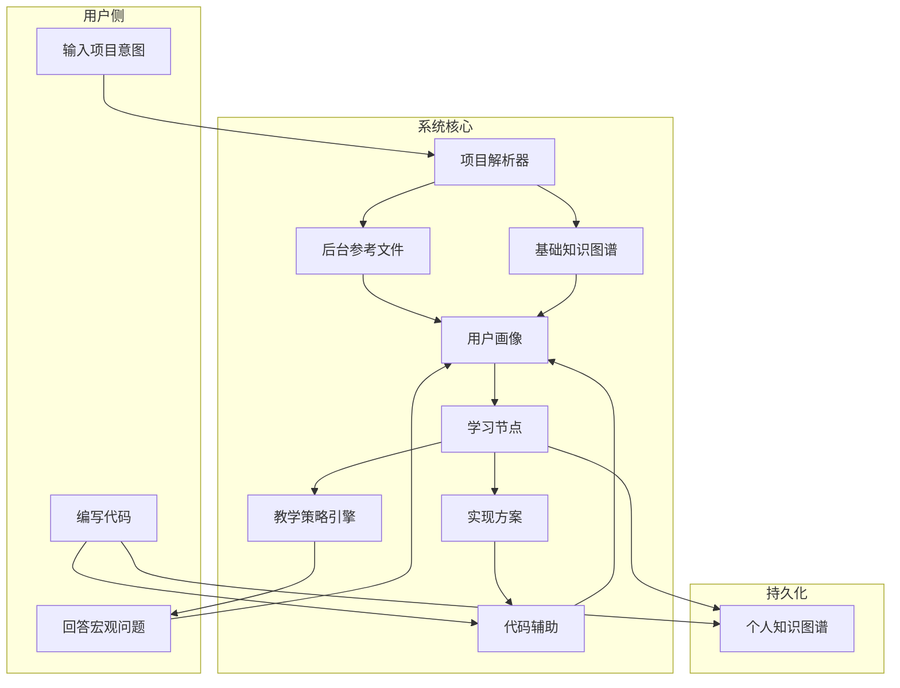

# PLA+ 系统架构

本文档对应项目架构图：以**项目解析器**为起点，经**用户建模**与**教学策略**，完成**实现与代码辅助**，并沉淀**个人知识图谱**。

---

## 1. 总体数据流



---

## 2. 项目解析器（Project Parser）

**输入**：项目名称 + 可选补充说明  
**输出**（均存后台，不在前端展示全文）：

| 序号 | 段落 | 说明 |
|------|------|------|
| 1 | 项目目标 | 要达成什么 |
| 2 | 问题定义 | 形式化问题陈述 |
| 3 | 输入/输出/约束 | 数据流、模型、loss 等 |
| 4 | 任务分解 | 阶段与模块 |
| 5 | 知识与技能依赖 | 需掌握的概念 |
| 6 | 实现方案 | 技术路线与接口 |
| 7 | 运行、验证与调试 | 如何跑通与评估 |
| 8 | 迭代优化 | 改进方向（v1 未含，PLA+ 新增） |

另生成 **基础知识图谱**（项目视角：概念节点及依赖关系）。

**存储**：`backend/data/frameworks/{session_id}.json` + `.md`（迁移自 PLA v1 约定）。

---

## 3. 用户画像 & 学习节点

1. 系统提出**宏观问题**（项目理解、先验知识）。
2. Prompt 分析用户回答 → **用户画像**（水平、盲区、偏好）。
3. 结合「项目解析层次 + 用户画像」→ **学习节点序列**（当前应攻克的能力点）。
4. 对每个节点的输出原则：**引导思考**，非直接灌输答案。

---

## 4. 教学策略引擎（Pedagogy）

按场景选用以下动作之一或组合：

| 策略 | 英文 | 用途 |
|------|------|------|
| 解释 | Explain | 定义概念 |
| 落地 | Ground | 绑定当前项目实例 |
| 演示 | Demonstrate | 最小示例 |
| 提问 | Ask | 诊断 / 引导性问题 |
| 提示 | Hint | 分层 hint |
| 挑战 | Challenge | 预测、修改、设计 |
| 验证 | Verify | 检查代码 / 解释 / 结果 |
| 反思 | Reflect | 总结「为什么」 |
| 推进 | Advance | 进入下一节点 |

---

## 5. 实现与代码辅助

- 知识节点就绪后 → 输出**具体实现方案**（自然语言 + 模块边界）。
- 用户编码时提供辅助，区分：
  - **理解型**：解释含义与原理；
  - **补全型**：练习式代码完成任务。
- 持续分析用户编码行为，**回写用户画像**与学习节点进度。

---

## 6. 个人知识图谱

- 与「基础知识图谱」（项目视角）分离。
- 记录用户**已掌握 / 进行中 / 未开始**的知识点。
- 随 Advance、Verify、Reflect 等事件更新。

---

## 7. 后端模块划分

```
app/modules/
├── project_parser/     # 解析链 + framework 文件 + 项目知识图谱
├── user_profiling/     # 画像 schema、宏观问答、学习节点
├── pedagogy/           # 策略选择与 prompt 模板
├── knowledge_graph/    # 图谱存储与查询（项目 + 个人）
└── implementation/     # 实现方案、代码辅助、行为分析
```

`app/api/routes.py` 仅做 HTTP 适配，业务逻辑在各 module 的 service 层。

---

## 8. 技术栈（计划）

与 PLA v1 保持一致，便于迁移：

- **后端**：FastAPI、Pydantic v2、SQLAlchemy、SQLite、httpx（OpenAI 兼容 LLM）
- **前端**：React 18、TypeScript、Vite、Tailwind、Monaco、React Flow（知识图谱）

---

## 9. PLA v1 → PLA+ 迁移映射

| v1 路径 | PLA+ 模块 |
|---------|-----------|
| `framework_store.py` | `modules/project_parser/store.py` |
| `prompt_builder` TASK_QA | `modules/pedagogy` + `user_profiling` |
| `presetProjects.ts` | 逐步替换为解析器动态方案 |
| `analysisTasks` 六步 | `user_profiling` 学习节点 |
| `/api/task-qa` | 扩展：读 framework + 画像 + 策略 |
