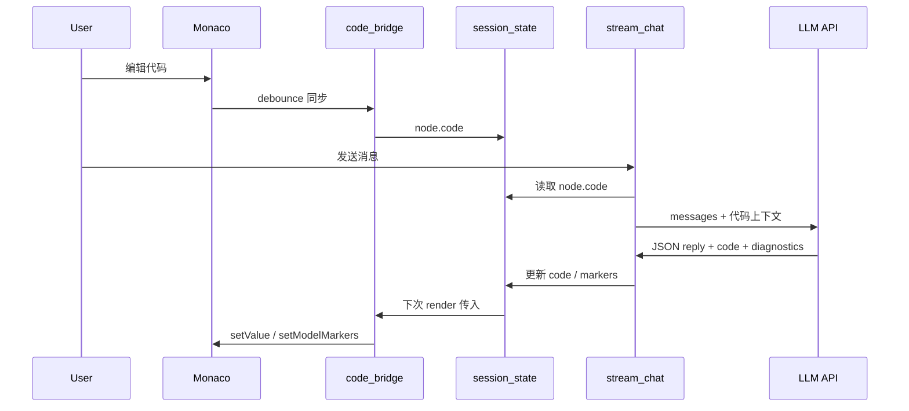

# VS Code 布局 + LeetCode 风格代码区实施计划

## 用户要求（明确）

**在 `ai_new_branch_newest_one` 文件夹里面新建一个子文件夹，新版本的所有创建和修改，全部在这个子文件夹内部完成。**

```
ai_new_branch_newest_one/          ← 当前项目（外层，不动）
│
├── navigator.py                   ← 旧文件，不修改
├── functions.py                   ← 旧文件，不修改
├── pages/page1.py                 ← 旧文件，不修改
├── ...（其他现有文件都不动）
│
└── 【新文件夹】/                  ← 在这里面做新版本
    ├── navigator.py               ← 新版本入口（复制后改）
    ├── pages/ide.py               ← IDE 主页面在这里建
    ├── static/editor/             ← 编辑器在这里建
    └── ...（只动这里面）
```

**一句话**：外层 = 旧版保留；内层新文件夹 = 新版 IDE，所有工作只在内层进行。

---

## 核心决策

1. **折中页面方案**：新增 `pages/ide.py` 为 IDE 主界面；保留 `page1.py` 为简洁聊天模式
2. **隔离开发**：所有创建与修改仅在**新文件夹**内进行
3. **原项目根部只读**：`ai_new_branch_newest_one/` 根目录下的 `navigator.py`、`page1.py`、`functions.py` 等 **不做任何改动**；所有新代码写在子文件夹 `workspace/` 内

---

## 新项目位置与目录结构

**路径**：`ai_new_branch_newest_one/workspace/`（当前项目内的子文件夹）

```
ai_new_branch_newest_one/
├── navigator.py               ← 不动（旧入口）
├── functions.py               ← 不动
├── stream_chat.py             ← 不动
├── pages/page1.py             ← 不动
├── pages/login.py             ← 不动
│
└── workspace/                 ← 新文件夹（你指定的名字），所有新版本工作在这里
    ├── navigator.py             # 新版本入口
    ├── pages/ide.py             # IDE 主页面（避免与文件夹同名冲突）
    ├── static/editor/
    └── ...
```

**启动新项目**（与旧入口分离）：

```powershell
cd ai_new_branch_newest_one/workspace
streamlit run navigator.py
```

**启动旧项目**（不受影响）：

```powershell
cd ai_new_branch_newest_one
streamlit run navigator.py
```

**为何复制而非 import 原项目？**

| 方式 | 呈现效果 | 作者读取 | 对原项目影响 |
|------|---------|---------|-------------|
| `sys.path` 引用原项目 | 好 | 需跨目录跳转，逻辑分散 | 零修改，但扩展需 monkey-patch |
| **复制后独立演进（采用）** | 好 | 单文件夹自包含，结构清晰 | **零修改**，改坏不影响旧版 |

复制后在新项目中自由增删；旧版 `streamlit run ai_new_branch_newest_one/navigator.py` 仍可独立运行对照。

---

## 目标布局（对标 VS Code）

```mermaid
flowchart TB
    subgraph sidebar [st.sidebar 主侧边栏]
        ActivityBar[视图切换: Explorer / Plan / Settings]
        Explorer[知识树 Explorer]
        PlanView[逻辑方案 + 执行步骤]
        SettingsView[模式 / 模型 / 导出 / 账户]
    end

    subgraph main [主编辑区]
        TabBar[文件 Tab: main.py]
        Monaco[Monaco Editor iframe]
    end

    subgraph panel [底部 Panel]
        ChatTab[Chat 对话]
        ProblemsTab[Problems 诊断]
        OutputTab[Output 运行输出]
    end

    subgraph status [状态栏]
        StatusInfo[Python | 已保存 | 模型 | 分支路径]
    end

    sidebar --> main
    main --> panel
    panel --> status
```

| VS Code 区域 | 映射 | 实现文件（均在 workspace） |
|-------------|------|----------------------------------|
| Primary Sidebar | 知识树 + 方案 + 设置 | `functions.render_vscode_sidebar()` |
| Editor Group | Monaco 代码编辑 | `code_bridge.render_editor()` |
| Panel | Chat / Problems / Output | `pages/ide.py` |
| Status Bar | 语言、保存态、模型 | `functions.render_status_bar()` |

---

## 文件变更清单（仅 workspace）

### 新建

| 路径 | 职责 |
|------|------|
| `workspace/` | 整个新项目根目录 |
| `code_bridge.py` | `declare_component` 封装 Monaco；读写 session；应用 diagnostics |
| `static/editor/*` | Monaco CDN、VS Light 主题、工具栏（保存/格式化/复制） |
| `pages/ide.py` | VS Code 式 IDE 主页面 |
| `.streamlit/config.toml` | `layout = "wide"`，基础主题 |
| `README.md` | 启动说明、与旧版差异 |

### 复制后修改（不动原文件）

| 源（只读复制） | 新项目中改动 |
|---------------|-------------|
| `ai_new_branch_newest_one/functions.py` | 增 `SessionNode.code`；`render_vscode_sidebar`；`render_status_bar`；扩展 `parse_ai_reply` |
| `ai_new_branch_newest_one/stream_chat.py` | 注入 `current_code`；解析 AI 的 code/diagnostics |
| `ai_new_branch_newest_one/pages/login.py` | 登录成功跳转 `pages/ide.py` |
| `ai_new_branch_newest_one/navigator.py` | 注册 workspace，置顶；page1 标「简洁聊天」 |
| `ai_new_branch_newest_one/pages/page1.py` | **尽量不改**，仅必要时改 import 路径 |
| `ai_new_branch_newest_one/promt_list.py` | Phase 1 原样复制；Phase 4 增 code JSON 字段 |

### 绝对不修改

- `ai_new_branch_newest_one/` 下**全部文件**

---

## 数据流与 AI 协作



**Session 扩展**（在新项目 `functions.py` 的 `SessionNode` 上）：

```python
node.code = ""
node.logic_plan = []
node.execution_steps = []
st.session_state.editor_diagnostics = []
```

---

## 分阶段实施

### Phase 0 — 脚手架（最先做）

1. 在 `ai_new_branch_newest_one/` 下创建子文件夹 `workspace/`
2. 在其内创建 `pages/`、`.streamlit/`、`static/editor/` 空目录
3. 从**上一级（项目根部）**复制 6 个文件到新文件夹：
   - `navigator.py` → `workspace/navigator.py`
   - `functions.py` → `workspace/functions.py`
   - `stream_chat.py` → `workspace/stream_chat.py`
   - `promt_list.py` → `workspace/promt_list.py`
   - `pages/login.py` → `workspace/pages/login.py`
   - `pages/page1.py` → `workspace/pages/page1.py`
4. 新建 `workspace/README.md`（说明双入口、启动命令）
5. 验证：在 `workspace/` 内运行 `streamlit run navigator.py`，聊天功能与旧版一致

### Phase 1 — Monaco MVP + workspace 骨架

1. `static/editor/` + `code_bridge.py`
2. `pages/ide.py`：Editor 主区 + Chat Panel（复用 `show_messages` / `chat_with_ai`）
3. `functions.py`：`SessionNode.code` + 存取函数
4. `navigator.py` + `login.py` 路由至 workspace

**验收**：登录 → workspace → 编辑/保存代码 → 底部对话可用；旧项目仍可独立运行。

### Phase 2 — VS Code 侧边栏

- `render_vscode_sidebar()`：Explorer / Plan / Settings 三视图
- `render_status_bar()` + VS Code 风格 CSS
- Settings 视图迁入模式、模型、导出等（从 workspace 内 page1 逻辑抽取，**不改旧 page1 源文件**）

### Phase 3 — 静态智能（非 AI）

- Monaco Python snippet 补全（torch/cv2 等）
- `ast.parse()` → Problems Panel + 波浪线 markers

### Phase 4 — AI 读/写/审代码

- 扩展 `parse_ai_reply` / `chat_with_ai` / `promt_list` JSON 约定（code、diagnostics）
- workspace 增加「请 AI 检查代码」按钮

### Phase 5 — 运行 Output（可选）

- 沙箱 `subprocess` + Output Panel

---

## 关键技术约束

| 风险 | 对策 |
|------|------|
| 新旧项目逻辑漂移 | README 标注 fork 日期；Phase 0 复制后独立演进 |
| Streamlit rerun 闪烁 | session_state 为代码唯一源；显式保存按钮 |
| iframe 通信 | `declare_component` 双向回调 |
| AI 覆盖用户代码 | diff 预览 + 用户确认后应用 |

---

## 建议实施顺序

1. Phase 0：新建文件夹 + 复制 + 验证旧功能可跑
2. `code_bridge.py` + `static/editor/`
3. `pages/ide.py` + `SessionNode.code`
4. 路由 + 侧边栏 + 状态栏
5. 静态诊断 + AI 联调

---

## 不在本计划范围

- 修改 `ai_new_branch_newest_one/` **根部**任何文件（仅允许在其内**新建** `workspace/` 子目录）
- 多语言编辑器（默认 Python）
- 完整 LSP / 云端持久化
